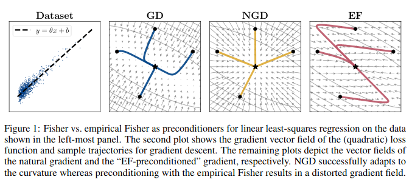
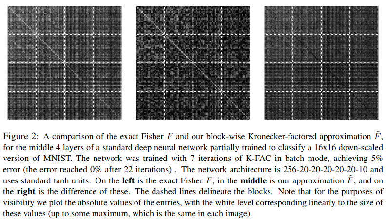
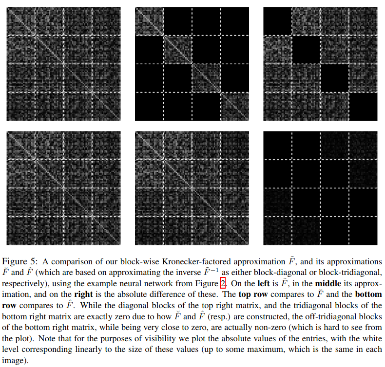
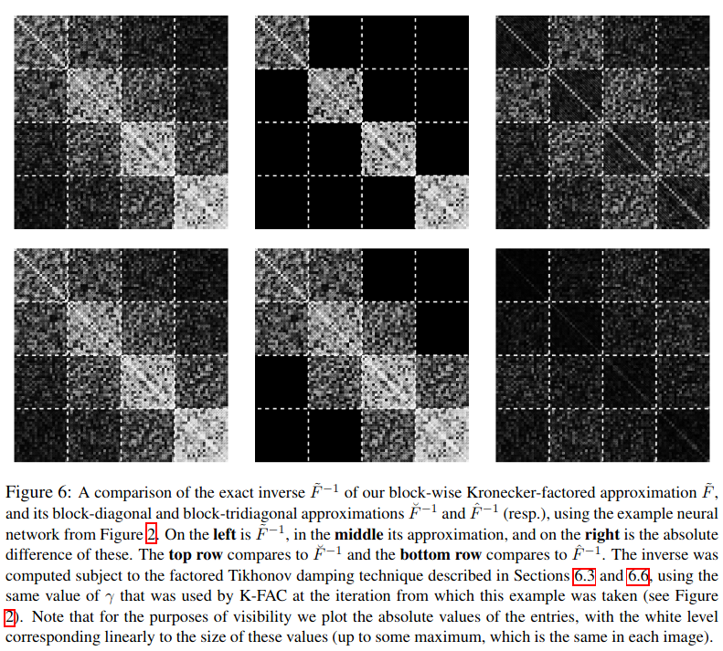
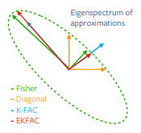
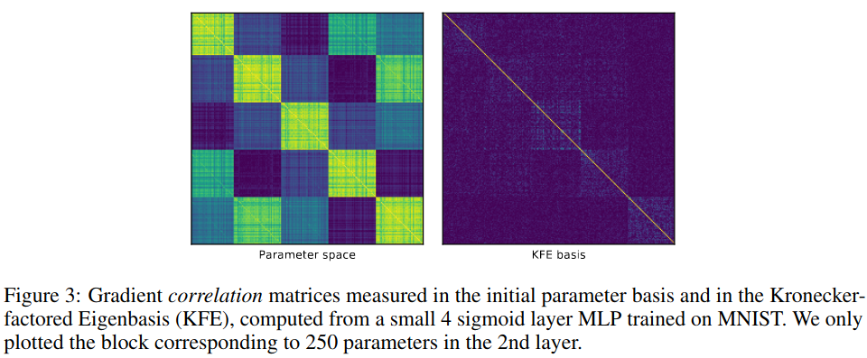
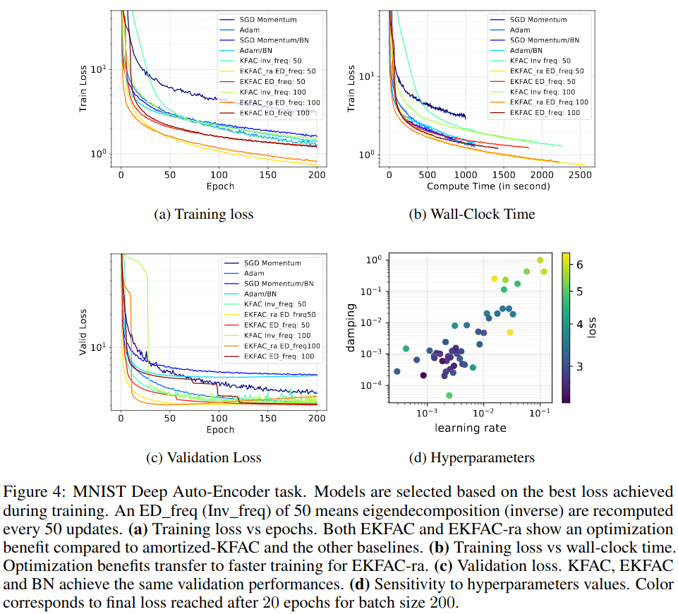

# Introduction to KFAC and EKFAC

###### Ejaaz Merali

---

## Outline

- Quick review of NGD
- Sidebar: Limitations of using the Empirical Fisher
- Overview of KFAC
- Overview of EKFAC

---

## Review of Natural Gradient Descent

Given a functional $F$, standard SGD updates take the form:

$$
\theta_{t+1} = \theta_t - \lambda_t \nabla F(\theta_t)
$$

2nd-order methods involve introducing a preconditioning matrix $G$ which encodes local curvature information:

$$
\theta_{t+1} = \theta_t - \lambda_t G^{-1}(\theta_t) \nabla F(\theta_t)
$$

NGD uses the Fisher Information Matrix (FIM) as the preconditioner

$$
G := \mathbb{E}_{p_\theta}\left\lbrack (\partial_i \ln p_\theta)(\partial_j \ln p_\theta)\right\rbrack
=: \mathbb{E}_{p_\theta}\left\lbrack \mathcal{D}\theta \mathcal{D}\theta^\top \right\rbrack
$$

Often, we instead estimate the *Empirical* FIM (EFIM) using samples from the training set:

$$
G := \mathbb{E}_{q}\left\lbrack (\partial_i \ln p_\theta)(\partial_j \ln p_\theta)\right\rbrack
$$

---

## Sidebar: Limitations of using the Empirical FIM

Recall that the EFIM differs from the true FIM in the distribution over which the expectation is computed

Kunstner et al. showed (among other things) that for a simple linear regression problem, the EFIM gave a distorted gradient field, while NGD gave a very simple gradient field

However, as has been shown empirically by the success of EFIM-based NGD (and it's approximations), it still seems to be a useful method

tl;dr if you can't draw samples from your model, don't be surprised if preconditioning with the EFIM fails

---
<!--
_class: default
_footer: '(Kunstner et al. 2019)'
-->

---

## Overview of KFAC

Let's consider $G$ for a deep feed-forward net&mdash;ignoring all considerations of what distribution we're computing expectations over

$$
\begin{aligned}
G &= \mathbb{E}\left\lbrack \mathcal{D}\theta \mathcal{D}\theta^\top \right\rbrack \\
&= \mathbb{E}\left\lbrack
(\mathcal{D}\theta_1^\top \mathcal{D}\theta_2^\top \ldots \mathcal{D}\theta_\ell^\top)^\top
(\mathcal{D}\theta_1^\top \mathcal{D}\theta_2^\top \ldots \mathcal{D}\theta_\ell^\top)
\right\rbrack\\
&= \begin{bmatrix}
\mathbb{E}\left\lbrack \mathcal{D}\theta_1 \mathcal{D}\theta_1^\top \right\rbrack &
\mathbb{E}\left\lbrack \mathcal{D}\theta_1 \mathcal{D}\theta_2^\top \right\rbrack & \cdots &
\mathbb{E}\left\lbrack \mathcal{D}\theta_1 \mathcal{D}\theta_\ell^\top \right\rbrack \\
\mathbb{E}\left\lbrack \mathcal{D}\theta_2 \mathcal{D}\theta_1^\top \right\rbrack &
\mathbb{E}\left\lbrack \mathcal{D}\theta_2 \mathcal{D}\theta_2^\top \right\rbrack & \cdots &
\mathbb{E}\left\lbrack \mathcal{D}\theta_2 \mathcal{D}\theta_\ell^\top \right\rbrack \\
\vdots & \vdots & \ddots & \vdots \\
\mathbb{E}\left\lbrack \mathcal{D}\theta_\ell \mathcal{D}\theta_1^\top \right\rbrack &
\mathbb{E}\left\lbrack \mathcal{D}\theta_\ell \mathcal{D}\theta_2^\top \right\rbrack & \cdots &
\mathbb{E}\left\lbrack \mathcal{D}\theta_\ell \mathcal{D}\theta_\ell^\top \right\rbrack \\
\end{bmatrix}
\end{aligned}
$$

---

Examining the individual blocks of the matrix:

$$
\begin{aligned}
G_{i,j} &= \mathbb{E}\left\lbrack \mathcal{D}\theta_i \mathcal{D}\theta_j^\top \right\rbrack \\
\end{aligned}
$$

Note: $\mathcal{D}\theta_i = \bar{a}_{i-1} \otimes g_i$, where $\bar{a}_{i-1}$ is the input to the $i$th layer (with a 1 appended, allowing us to absorb the bias into the weight matrix). $g_i$ is the gradient of the loss wrt $s_i = W_i \bar{a}_{i-1}$

The block-elements of $G$ are thus:

$$
\begin{aligned}
G_{i,j} &= \mathbb{E}\left\lbrack
(\bar{a}_{i-1} \otimes g_i)
(\bar{a}_{j-1} \otimes g_j)^\top
\right\rbrack
= \mathbb{E}\left\lbrack
(\bar{a}_{i-1}\bar{a}_{j-1}^\top)
\otimes
(g_i g_j^\top)
\right\rbrack \\
\end{aligned}
$$

### 1st Approximation: (outer products of) layer inputs and gradients are statistically independent

$$
G_{i,j} \approx \mathbb{E}\left\lbrack
\bar{a}_{i-1}\bar{a}_{j-1}^\top\right\rbrack
\otimes
\mathbb{E}\left\lbrack
g_i g_j^\top
\right\rbrack
= A_{i,j} \otimes B_{i,j} =: \tilde{G}_{i,j}
$$

---
This Kronecker structure is where the name for KFAC comes from: Kronecker-Factored Approximate Curvature.

The independence approximation has no actual theoretical justification, but empirical result show that it seems to work fairly well at capturing the "coarse structure" of the exact Fisher.

<!--
_class: default
_footer: '(Martens and Grosse, 2016)'
-->

---

Writing out $G$:

$$
\tilde{G}
= \begin{bmatrix}
A_{1,1} \otimes B_{1,1} &
A_{1,2} \otimes B_{1,2} & \cdots &
A_{1,\ell} \otimes B_{1,\ell} \\
A_{2,1} \otimes B_{2,1} &
A_{2,2} \otimes B_{2,2} & \cdots &
A_{2,\ell} \otimes B_{2,\ell} \\
\vdots & \vdots & \ddots & \vdots \\
A_{\ell,1} \otimes B_{\ell,1} &
A_{\ell,2} \otimes B_{\ell,2} & \cdots &
A_{\ell,\ell} \otimes B_{\ell,\ell} \\
\end{bmatrix}
$$

This is called a Khatri-Rao product. There is not yet an efficient method to invert a Khatri-Rao matrix. Which brings us to our next approximation.

---

### 2nd Approximation: $\tilde{G} \approx$ block-diagonal

This means we're assuming that covariances *between* layers are negligible. Call $\breve{G}$ the block-diagonal approximation to $\tilde{G}$:

$$
\begin{aligned}
\breve{G} &:= \operatorname{diag}(\tilde{G}_{1,1}, \tilde{G}_{2,2}, \ldots, \tilde{G}_{\ell,\ell}) \\
&= \operatorname{diag}(
    A_{1,1}\otimes B_{1,1},
    A_{2,2}\otimes B_{2,2},
    \ldots
    A_{\ell,\ell}\otimes B_{\ell,\ell}
)
\end{aligned}
$$

The inverse is thus:

$$
\breve{G}^{-1} = \operatorname{diag}(
    A_{1,1}^{-1}\otimes B_{1,1}^{-1},
    A_{2,2}^{-1}\otimes B_{2,2}^{-1},
    \ldots
    A_{\ell,\ell}^{-1}\otimes B_{\ell,\ell}^{-1}
)
$$

Inverting the full matrix $\breve{G}$ is thus equivalent to inverting $2\ell$ smaller matrices&ndash;fairly easy to do. We may also that we do not need to build each of these Kronecker products when applying $\breve{G}^{-1}$ to a gradient vector. We instead make use of Roth's lemma (aka the vec trick):

$$
(C \otimes D) \operatorname{vec}(X) = \operatorname{vec}(DXC^\top)
$$

---

### Alternative 2nd Approximation: $\tilde{G} \approx$ block-tridiagonal

We're assuming that covariances between adjacent layers are no longer negligible. Inverting this is much more complicated so we won't discuss this further.

Note, however, that the inverse of the block tri-diagonal form $\hat{G}$ is a much better approximation to $\tilde{G}^{-1}$ than $\breve{G}^{-1}$

---

<!--
_class: default
_footer: '(Martens and Grosse, 2016)'
-->

---

<!--
_class: default
_footer: '(Martens and Grosse, 2016)'
-->

---

As is typical of 2nd-order methods, in practice, we often only re-compute the preconditioning every $n$ gradient updates, thus, our preconditioned gradient updates will accumulate some error as we progress further away from our last computation of the preconditioning matrix.

This is part of the motivation for EKFAC (Eigenvalue-corrected KFAC), which allows us to perform cheap partial corrections to our KFAC-preconditioner at every gradient update.

---

## Overview of EKFAC

EKFAC makes use of the block-diagonal version of KFAC, $\breve{G}$. Focus on a single block of $\breve{G}$:

$$
\breve{G}_{i,i} = A_{i,i} \otimes B_{i,i}
$$

we'll drop the block indices from now on.
Consider it's diagonalization:

$$
\breve{G} = (U_A S_A U_A^\top) \otimes (U_B S_B U_B^\top)
= (U_A \otimes U_B) (S_A \otimes S_B) (U_A \otimes U_B)^\top
$$

EKFAC's correction involves correcting the eigenvalue part, substituting $S_A \otimes S_B$ with a more general diagonal matrix $S$, containing more free parameters than the Kronecker form.

---

Consider the case where we *hadn't* made the statistical independence approximation, then $G = U S U^\top$ has no Kronecker structure.

Geometric POV: unitaries project our gradients into the eigenbasis of $G$, they are then scaled by the diagonal matrix $S$, and then projecting back into parameter space. It can be shown that $S_{ii} = \mathbb{E}[(U^\top \nabla_\theta)_i^2]$. That is, $S$ is equal to the second-moment of the gradient in the eigenbasis of $G$.

However, $S_A \otimes S_B$ does not fulfill such a role for $\breve{G}$.

---

We thus propose a correction to $\breve{G}$:

$$
G_\text{EKFAC} = (U_A \otimes U_B) S (U_A \otimes U_B)^\top
$$

where $S_{ii} = \mathbb{E}[((U_A\otimes U_B)^\top \nabla_\theta)^2]$

It can be shown that such an $S$ is optimal in the sense that it minimizes the Frobenius norm:

$$
\| G - (U_A \otimes U_B) S (U_A \otimes U_B)^\top \|_F
$$

when $S$ is diagonal. It is thus a better approximation to $G$ than $\breve{G}$.

---

<!--
_class: default
_footer: '(George at al. 2018)'
-->

---

$S$ is fairly simple to update at each step, given $U_A$ and $U_B$ (takes about as much time as computing the gradient)

We can thus update the eigenbasis every $n$ gradient updates, while updating $S$ with *every* gradient update.

Applying the inverse of $G_\text{EKFAC}$ to a gradient is fairly simple too, given that we've already diagonalized it.

$$
G_\text{EKFAC}^{-1} \nabla_\theta = (U_A \otimes U_B) S^{-1} (U_A \otimes U_B)^\top \nabla_\theta
$$

and we can again use Roth's lemma to avoid having to construct the full Kronecker product of the unitaries.

---

<!--
_class: default
_footer: '(George at al. 2018)'
-->

---

<!--
_class: default
_footer: '(George at al. 2018)'
-->

---

## Summary

- We approximated the Fisher Information Matrix by:
  - Assuming statistical independence between layer inputs and parameter gradients, yielding a Kronecker product
  - Assuming no interlayer covariances i.e. that the FIM is approximately block-diagonal

- We then derived EKFAC, which refines the first approximation, and also allows us to perform cheap partial updates to the approximated FIM

---

## Thank you

---

## References

George, Thomas, et al. "Fast approximate natural gradient descent in a kronecker factored eigenbasis." Advances in Neural Information Processing Systems. 2018.

Kunstner, Frederik, Philipp Hennig, and Lukas Balles. "Limitations of the empirical Fisher approximation for natural gradient descent." Advances in Neural Information Processing Systems. 2019.

Martens, James, and Roger Grosse. "Optimizing neural networks with kronecker-factored approximate curvature." International conference on machine learning. 2015.